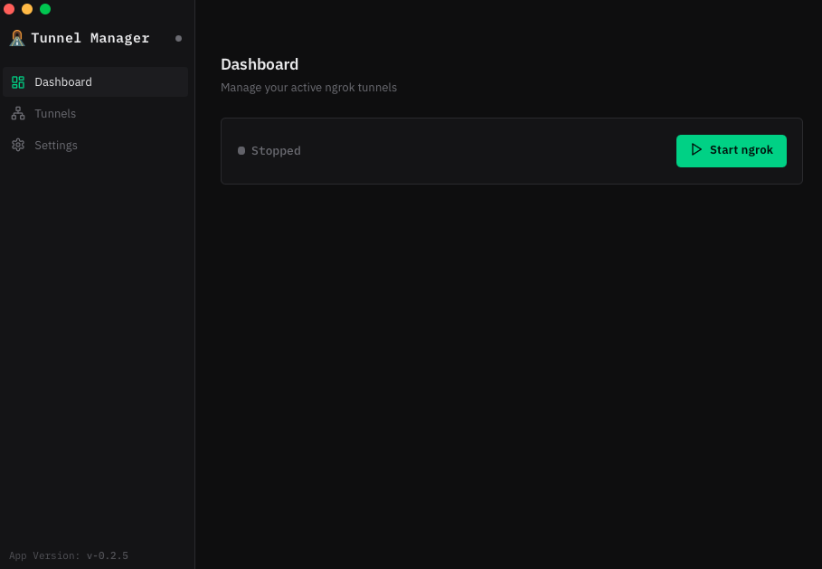
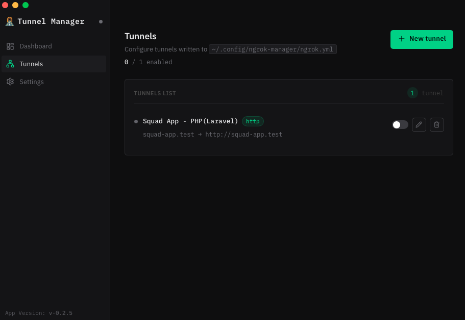
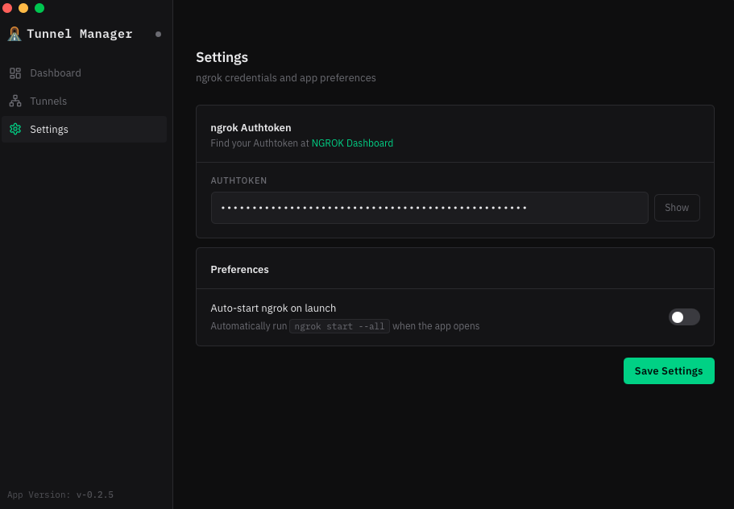

# Tunnel Manager

A lightweight desktop app (Tauri + React) for managing `ngrok` tunnels from a clean UI — no more memorizing config paths or authtoken flags.

## Table of contents

- [Why you need this](#why-you-need-this)
- [Features](#features)
- [Screenshots](#screenshots)
- [How it works](#how-it-works)
- [Requirements](#requirements)
- [Configuration](#configuration)
  - [Data layout](#data-layout)
  - [`settings.json`](#settingsjson)
  - [`tunnel-definitions.json`](#tunnel-definitionsjson)
  - [`ngrok.yml` (generated)](#ngrok-yml-generated)
- [Platform support](#platform-support)
- [Installation](#installation)
- [Troubleshooting macOS quarantine](#troubleshooting-macos-quarantine)
- [Usage](#usage)
- [Customization](#customization)
  - [ngrok binary resolution](#ngrok-binary-resolution)
- [Release builds and version numbers](#release-builds-and-version-numbers)
- [Repository URL (forks and org transfers)](#repository-url-forks-and-org-transfers)
- [Development](#development)
- [Contributing](#contributing)

---

## Why you need this

If you regularly run ngrok for local development, the repetitive parts are usually:

- keeping tunnel definitions organized
- remembering where your `ngrok.yml` lives
- passing your authtoken and starting/stopping tunnels consistently

Tunnel Manager wraps those steps in a simple UI and stores data under `~/.config/ngrok-manager/`.

> [!TIP]
> Free-plan friendly: define multiple tunnels, choose which are **enabled**, and start them together in one click (within whatever concurrency your ngrok plan allows).

---

## Features

| Feature | Description |
|---|---|
| **Dashboard** | Start/stop `ngrok` and view active tunnels |
| **Tunnels** | Add, edit, and delete tunnel definitions; toggle which tunnels are enabled for the next start |
| **Settings** | Save your `ngrok` authtoken and optionally auto-start on launch |

---

## Screenshots

UI previews are in **`docs/screenshots/`** (documentation only; not shipped in the app bundle).

<details>
<summary><strong>View screenshots</strong></summary>







</details>

---

## How it works

- **Tunnel definitions** you edit in the app are stored in **`tunnel-definitions.json`**.
- **Enabled tunnel names** and preferences live in **`settings.json`**.
- When you click **Start ngrok**, the app writes a fresh **`ngrok.yml`** that contains only **enabled** tunnels, then runs:

```bash
ngrok start --all --authtoken <token> --config <path-to-ngrok.yml> --log stderr --log-level error
```

When you stop, it kills the managed `ngrok` child process.

---

## Requirements

- `ngrok` CLI installed on your machine
- Node.js + pnpm
- Rust toolchain (for development / building the Tauri backend)

---

## Configuration

All paths below use `~/.config/ngrok-manager/` on macOS and Linux (see [XDG](https://specifications.freedesktop.org/basedir-spec/basedir-spec-latest.html) for Linux conventions).

### Data layout

| File | Role |
|------|------|
| **`settings.json`** | Authtoken, auto-start, and the list of **enabled** tunnel names |
| **`tunnel-definitions.json`** | **Source of truth** for tunnel definitions (name → proto, addr, optional `host_header`) |
| **`ngrok.yml`** | **Generated** when you start ngrok — only enabled tunnels; do not treat this as the place to edit tunnels long-term |

Legacy installs may be migrated from older paths on first launch; new data always lands in the layout above.

### settings.json

| Key | Type | Description |
|---|---|---|
| `auto_start` | boolean | Start ngrok automatically when the app launches |
| `authtoken` | string (optional) | Your ngrok authtoken |
| `enabled_tunnels` | string[] | Names of tunnels to include the next time ngrok starts (must exist in `tunnel-definitions.json`) |

> [!WARNING]
> The `authtoken` is stored as plaintext in `settings.json`. Treat this file like a password — do not commit it, share it, or expose it in logs. On macOS, restrict permissions (`chmod 600 ~/.config/ngrok-manager/settings.json`).

### tunnel-definitions.json

JSON object: tunnel name → `{ "proto": "http" \| "tcp" \| "tls", "addr": "...", "host_header"?: "..." }`.

Example:

```json
{
  "web": {
    "proto": "http",
    "addr": "http://localhost:3000"
  },
  "api": {
    "proto": "http",
    "addr": "4000",
    "host_header": "api.local"
  }
}
```

### ngrok.yml (generated)

When ngrok starts, the app writes ngrok v3–style YAML for **enabled** tunnels only:

```yaml
version: "3"
tunnels:
  your-tunnel-name:
    addr: "http://localhost:3000"
    proto: http
```

Supported `proto` values: `http`, `tcp`, `tls`. `host_header` is optional when present on the definition.

---

## Platform support

| Platform | Status | Notes |
|----------|--------|-------|
| macOS (arm64) | ✅ Supported | Primary target |
| macOS (x64) | ✅ Supported | |
| Linux (deb / rpm / AppImage) | ✅ Supported | |
| Windows | ❌ Not supported | Binary resolver and process management rely on Unix conventions |

---

## Installation

**Option A — Packaged build**

Download the DMG (macOS) or Linux bundle from [Releases](https://github.com/mubin-khalid/tunnel-manager/releases) and install like any other app for your platform.

> [!CAUTION]
> If macOS shows *“Tunnel Manager can’t be opened because Apple cannot check it for malware” or "App is damaged" etc* (Gatekeeper quarantine), remove the quarantine attribute and try again.
>
> ```bash
> xattr -dr com.apple.quarantine "/Applications/Tunnel Manager.app"
> ```

**Option B — Build locally**

```bash
pnpm tauri dev       # development
pnpm tauri build     # produce macOS bundles (including DMG)
```

---

## Troubleshooting macOS quarantine

If macOS blocks the app with Gatekeeper quarantine errors, run:

```bash
xattr -dr com.apple.quarantine "/Applications/Tunnel Manager.app"
```

If your `.app` is located somewhere else (or has a different name), update the path accordingly.

---

## Usage

1. Open the app
2. Go to **Settings** → paste your `ngrok` authtoken
3. Go to **Tunnels** → add tunnel definitions and enable the ones you want
4. Go to **Dashboard** → click **Start ngrok**

---

## Customization

### ngrok binary resolution

On macOS, apps launched from Finder may not inherit your shell `PATH`. Tunnel Manager resolves `ngrok` in this order:

1. `NGROK_PATH` environment variable (if set)
2. `which ngrok` (normal PATH lookup)
3. Common Homebrew locations (`/usr/local/bin/ngrok`, `/opt/homebrew/bin/ngrok`)

To force a specific binary:

```bash
NGROK_PATH=/full/path/to/ngrok
```

---

## Release builds and version numbers

The **display / semver source of truth** is `package.json` → `"version"`.

Tauri also reads **`src-tauri/Cargo.toml`** and **`src-tauri/tauri.conf.json`**. Those **must match** `package.json` or installers and the in-app version string can disagree (for example DMG shows `0.2.4` while the tag is `v0.2.5`).

After bumping `package.json`:

```bash
pnpm prebuild
# or: node scripts/sync-version.mjs
```

Then **commit** the updated `Cargo.toml` and `tauri.conf.json` **before** you create the release tag.

The **release** workflow checks that all three versions match the tag; if they drift, the job fails with instructions to run `pnpm prebuild` and commit.

---

## Repository URL (forks and org transfers)

The **canonical Git remote** is `package.json` → [`repository`](https://docs.npmjs.com/cli/v9/configuring-npm/package-json#repository). The desktop app reads that value at build time (`VITE_REPOSITORY_URL`) for in-app links (for example the sidebar releases link).

After **moving or forking** the repo, update `repository` (and optionally `bugs` / `homepage`), then run:

```bash
pnpm sync:repo
```

That refreshes workflow badge URLs in this README and compare links in `CHANGELOG.md`. Rebuild the app so the embedded repo URL matches.

---

## Development

```bash
pnpm tauri dev        # start frontend + Tauri dev backend
pnpm lint && pnpm test   # ESLint + Vitest + Rust unit tests (same idea as CI)
pnpm build            # build frontend only
pnpm tauri build      # produce release bundles
cd src-tauri && cargo check  # verify Rust backend compiles
```

---

## Contributing

When submitting a PR:

- Keep scope focused — one logical change per PR
- Include a clear description of what changed and why
- For UI changes, attach a screenshot or reproduction steps
- Before opening, run `pnpm lint`, `pnpm test`, and `pnpm build` (and `pnpm tauri build` or `cargo check` when practical)

**PR description should cover:**

- What changed
- Why it changed
- How to test
